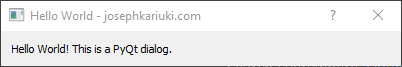
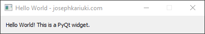
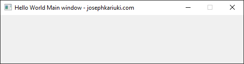

### Hello PyQt
This is a Hello world module for PyQt that contains some beginner user interfaces shown below.

1. This is a PyQt5 dialog. Dialogs are commonly used for communication and interaction with the user      
2. This is a PyQt5 widget. PyQt has rich and nodern collecion of widgets serving several purposes.      
3. This is a PyQt5 Main window. The main window provides a framework for building application GUIs.    

For details refer to the [PyQt  API documentation](https://doc.qt.io/qtforpython-5/api.html).