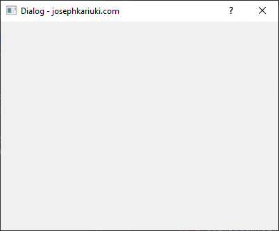
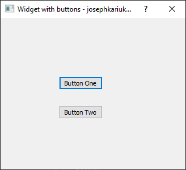
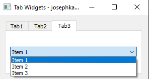

#### PyQt User Interfaces

This module contains PyQt basic user interfaces shown below.

1. This is a Main Window with status bar.      
2. This is a PyQt plain widget.      
2. This is a PyQt plain dialog.      
3. This is a PyQt Widget with buttons.      
4. This is a PyQt Widget with tabs.      

For details refer to the [PyQt  API documentation](https://doc.qt.io/qtforpython-5/api.html).