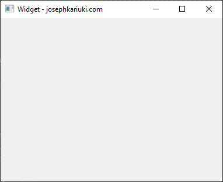

#### PyQt user interfaces

This module contains PyQt basic user interfaces which include:

1. Main window with status bar.      
2. Plain widget.      
2. Plain dialog.      
3. Widget with buttons.      