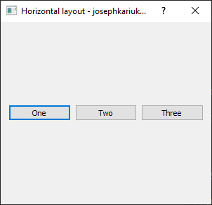
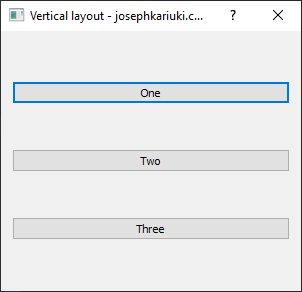
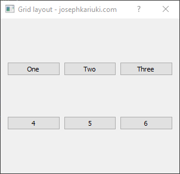
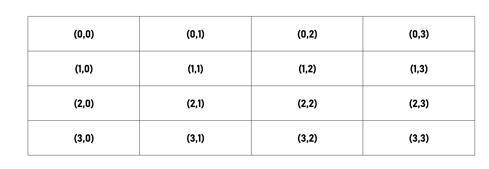
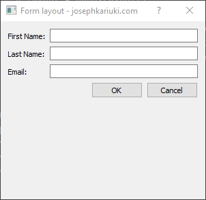

##### Layouts in PyQt

This is a layout module that showcases examples of layouts used in PyQt. Layouts are used to arrange or place user interface 
items such as widgets and labels in a clean and presentable way. However, if not handled carefully they can result in a
messy arrangement of items. The layouts include the following:

1. This is a Horizontal layout.      
2. This is a Vertical layout.      
3. This is a Grid layout.      
   The grid layout (QGridLayout) management row and column mapping appears as shown below for all grid layouts.  
     
4. This is a Form layout.      
5. This is a Stacked layout.

For details refer to the [PyQt  API documentation](https://doc.qt.io/qtforpython-5/api.html).
