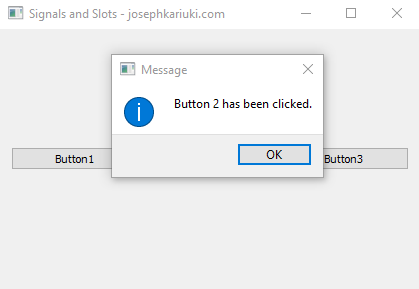

##### Events in PyQt

The graphical user interfaces are event-driven and these events are the mostly generated by the user. The event in PyQt 
consist of three elements;
1. <b>Event Source</b> - Changing in state of anf object that triggers an event.
2. <b>Event Object</b> - This is what triggers an event state change in the event source.
3. <b>Event Target</b> - The object that is notofoed once an event has been triggered.

A signal is triggered, which connects to a slot (this can be any python call).

1. An example is when the button is clicked and causes a message box to be shown depicted in the screenshot below.   
  
